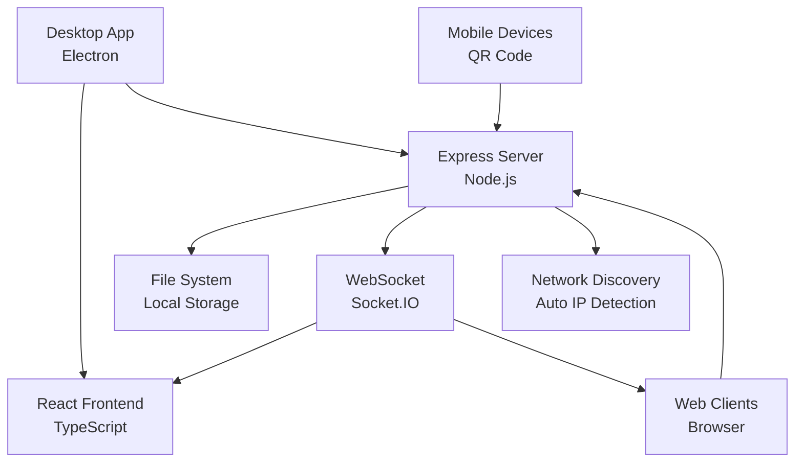

# 🌐 Local File Share

<div align="center">


[](https://opensource.org/licenses/MIT)
[](https://www.typescriptlang.org/)
[](https://reactjs.org/)
[](https://www.electronjs.org/)
[](https://nodejs.org/)

**A beautiful, privacy-focused cross-platform file sharing application for local networks**

*Share files instantly between devices without the cloud - secure, fast, and completely local*

[🚀 Quick Start](#installation) • [📖 Documentation](#usage) • [🛠️ Development](#development) • [🎯 Features](#features)

</div>

---

## ✨ Features

<div align="center">

| Feature | Description | Status |
|---------|-------------|--------|
| 🗂️ **Local Network Sharing** | Share files between devices without cloud storage | ✅ |
| 📱 **QR Code Connectivity** | Quick device connection via QR code scanning | ✅ |
| 🖥️ **Cross-Platform** | Works seamlessly on Windows, Mac, and Linux | ✅ |
| 🌐 **Web Interface** | Access via browser from any device on the network | ✅ |
| 📁 **Smart Folder Management** | Choose and manage custom shared folders | ✅ |
| 🔄 **Real-time Updates** | Live file sync using WebSocket technology | ✅ |
| 🎨 **Modern UI/UX** | Beautiful glassmorphism design with intuitive interface | ✅ |
| 🔒 **Privacy Focused** | Zero cloud dependency - everything stays local | ✅ |
| 📤 **Drag & Drop** | Effortless file upload with visual progress tracking | ✅ |
| 🗑️ **File Management** | Download, delete, and organize files seamlessly | ✅ |
| ⚡ **High Performance** | Optimized for large files up to 100MB | ✅ |
| 🔧 **Auto-Discovery** | Automatic network IP detection and port management | ✅ |

</div>

## 🏗️ Architecture

<div align="center">



**Modern Tech Stack:**
- **Frontend**: React 18 + TypeScript + Modern CSS
- **Backend**: Express.js + Socket.IO + Multer
- **Desktop**: Electron with native system integration
- **Real-time**: WebSocket for instant file synchronization
- **Security**: Local-only networking with no external dependencies

</div>

## 🚀 Quick Start

### 📋 Prerequisites

- **Node.js** 16.x or higher
- **npm** or **yarn** package manager
- **Git** for cloning the repository

### 🔧 Installation

1. **Clone the repository:**
   ```bash
   git clone https://github.com/your-username/local-file-share.git
   cd local-file-share
   ```

2. **Install dependencies:**
   ```bash
   npm install
   ```

3. **Start development mode:**
   ```bash
   npm run dev
   ```
   This launches both the React development server and Electron app simultaneously.

4. **Build for production:**
   ```bash
   npm run build
   npm run build:electron
   ```

### ⚡ One-Line Setup
```bash
git clone https://github.com/your-username/local-file-share.git && cd local-file-share && npm install && npm run dev
```

## 📱 Usage Guide

### 🖥️ Desktop Application

<div align="center">


</div>

1. **Launch the Application**
   - The app automatically starts the file sharing server
   - Your local IP and port are displayed prominently
   - A QR code is generated for easy mobile access

2. **Configure Shared Folder**
   ```
   📁 Default: ~/LocalFileShare
   🔧 Custom: Use "Change Folder" button
   🔄 Auto-sync: Changes are detected automatically
   ```

3. **Share Your Connection**
   - **QR Code**: Perfect for mobile devices
   - **URL Copy**: Click the copy button for quick sharing
   - **Network URL**: `http://[your-ip]:3001`

### 🌐 Web Interface Access

<div align="center">

| Method | Steps | Best For |
|--------|-------|----------|
| 📱 **QR Code** | Scan with camera app → Open link | Mobile devices |
| 🔗 **Direct URL** | Copy URL → Paste in browser | Desktop/laptop |
| 📋 **Manual Entry** | Type `http://[ip]:3001` | Any device |

</div>

### 📤 File Operations

#### Upload Files
- **Drag & Drop**: Simply drag files into the upload area
- **Click to Browse**: Click the upload area to select files
- **Progress Tracking**: Real-time upload progress with visual feedback
- **Multi-file Support**: Upload multiple files simultaneously

#### Download Files
- **One-Click Download**: Click the download button next to any file
- **Direct Browser Download**: Files download directly to your device
- **Resume Support**: Interrupted downloads can be resumed

#### Manage Files
- **Delete Files**: Remove files with confirmation dialog
- **Real-time Sync**: Changes appear instantly on all connected devices
- **File Information**: View file size, modification date, and type

### 🔧 Advanced Features

#### Network Configuration
- **Auto IP Detection**: Automatically finds your local network IP
- **Port Management**: Automatically selects available ports (starts at 3001)
- **Firewall Friendly**: Uses standard HTTP ports for compatibility

#### Security & Privacy
- **Local Only**: No data leaves your local network
- **No Registration**: No accounts or personal information required
- **Temporary Access**: No permanent connections or data storage

## 🎯 Use Cases

<div align="center">

| Scenario | Solution | Benefits |
|----------|----------|----------|
| 📱➡️💻 **Phone to Computer** | Scan QR code, upload photos/videos | Quick media transfer |
| 💻➡️📱 **Computer to Phone** | Copy URL, download files | Easy document sharing |
| 👥 **Team Collaboration** | Share URL with team members | Instant file sharing |
| 🏠 **Home Network** | Access from any device at home | Seamless device integration |
| 🎓 **Classroom/Office** | One person hosts, others connect | Group file distribution |
| 🔄 **Device Sync** | Keep files synchronized across devices | Real-time collaboration |

</div>

## 🛠️ Development

### 📊 Project Structure
```
local-file-share/
├── 📁 electron/              # Electron main process
│   ├── 🔧 main.js           # App entry point & window management
│   └── 🌐 server.js         # Express server & Socket.IO
├── 📁 src/                  # React frontend source
│   ├── 📁 components/       # Reusable React components
│   │   ├── 📤 FileUpload.tsx
│   │   ├── 📋 FileList.tsx
│   │   ├── 📱 QRCodeDisplay.tsx
│   │   ├── ℹ️ ServerInfo.tsx
│   │   └── 📁 FolderSelector.tsx
│   ├── 🎨 App.tsx           # Main application component
│   ├── 🎨 App.css           # Glassmorphism styling
│   └── 🚀 main.tsx          # React entry point
├── 📁 public/               # Static web assets
├── 📁 .github/              # GitHub configuration
├── 📄 package.json          # Dependencies & scripts
├── 📄 tsconfig.json         # TypeScript configuration
└── 📖 README.md             # This documentation
```

### 🎮 Available Scripts

| Command | Purpose | When to Use |
|---------|---------|-------------|
| `npm run dev` | Start full development environment | 🔨 Active development |
| `npm run dev:react` | React server only | 🌐 Frontend-only testing |
| `npm run dev:electron` | Electron app only | 🖥️ Desktop-specific testing |
| `npm run build` | Build React for production | 📦 Prepare for distribution |
| `npm run build:electron` | Create distributable packages | 🚀 Final app packaging |
| `npm run lint` | Check code quality | ✅ Code review |
| `npm run type-check` | TypeScript validation | 🔍 Type safety verification |

### 🔧 Development Workflow

1. **Setup Development Environment**
   ```bash
   npm install          # Install all dependencies
   npm run dev         # Start development servers
   ```

2. **Frontend Development**
   ```bash
   npm run dev:react   # React development server (localhost:5173)
   ```

3. **Backend/Electron Development**
   ```bash
   npm run dev:electron # Electron app with server
   ```

4. **Code Quality**
   ```bash
   npm run lint        # ESLint code checking
   npm run type-check  # TypeScript validation
   ```

### 🏗️ Building for Production

#### Desktop Application
```bash
npm run build:electron
```
Creates platform-specific installers:
- **Windows**: NSIS installer (`.exe`)
- **macOS**: DMG package (`.dmg`)
- **Linux**: AppImage (`.AppImage`)

#### Web Application
```bash
npm run build
```
Creates optimized static files in `dist/` folder for web deployment.

## 🔧 Configuration

### 🌐 Network Settings
- **Default Port**: 3001 (auto-increments if unavailable)
- **Bind Address**: 0.0.0.0 (accepts connections from all network interfaces)
- **File Size Limit**: 100MB per file (configurable in server.js)

### 📁 Folder Management
- **Default Shared Folder**: `~/LocalFileShare`
- **Custom Folders**: Select any accessible directory
- **Auto-Creation**: Folders are created automatically if they don't exist

### 🔒 Security Features
- **Local Network Only**: Server only accepts connections from local network
- **No External Dependencies**: All processing happens locally
- **File Validation**: Basic file type and size validation
- **Safe File Handling**: Duplicate name handling and safe file operations

## 🚨 Troubleshooting

<details>
<summary><strong>🔗 Connection Issues</strong></summary>

**Problem**: Can't connect to the server from other devices

**Solutions**:
- ✅ Ensure all devices are on the same WiFi network
- ✅ Check firewall settings (allow port 3001)
- ✅ Verify the IP address is correct
- ✅ Try a different port if 3001 is blocked
- ✅ Restart the application to refresh network settings

</details>

<details>
<summary><strong>📤 Upload Problems</strong></summary>

**Problem**: Files won't upload or uploads fail

**Solutions**:
- ✅ Check file size (must be under 100MB)
- ✅ Ensure sufficient disk space in shared folder
- ✅ Verify folder permissions
- ✅ Try uploading smaller files first
- ✅ Check network stability

</details>

<details>
<summary><strong>🖥️ Desktop App Issues</strong></summary>

**Problem**: Electron app won't start or crashes

**Solutions**:
- ✅ Update to latest Node.js version
- ✅ Clear npm cache: `npm cache clean --force`
- ✅ Reinstall dependencies: `rm -rf node_modules && npm install`
- ✅ Check for conflicting applications on port 3001
- ✅ Run with debug flags: `DEBUG=* npm run dev`

</details>

<details>
<summary><strong>🌐 Web Interface Problems</strong></summary>

**Problem**: Web interface doesn't load or functions incorrectly

**Solutions**:
- ✅ Clear browser cache and cookies
- ✅ Try a different browser
- ✅ Disable browser extensions temporarily
- ✅ Check browser console for error messages
- ✅ Ensure JavaScript is enabled

</details>

## 📈 Performance & Limitations

### ⚡ Performance Metrics
- **Concurrent Users**: Up to 20 simultaneous connections
- **File Transfer Speed**: Limited by network bandwidth
- **Memory Usage**: ~50-100MB RAM for desktop app
- **Startup Time**: 2-3 seconds typical startup

### 📏 Current Limitations
- **File Size**: 100MB maximum per file
- **File Types**: All types supported (no restrictions)
- **Network Scope**: Local network only
- **Simultaneous Uploads**: 5 files maximum

### 🔮 Future Enhancements
- [ ] **Folder Upload**: Drag and drop entire folders
- [ ] **File Compression**: Automatic compression for large files
- [ ] **Transfer Encryption**: End-to-end encryption for sensitive files
- [ ] **Mobile App**: Dedicated iOS/Android applications
- [ ] **Theme Customization**: Multiple UI themes and color schemes
- [ ] **File Preview**: In-browser preview for common file types
- [ ] **Transfer History**: Track and manage file transfer history
- [ ] **User Authentication**: Optional password protection
- [ ] **File Organization**: Folders and tagging system
- [ ] **Bandwidth Control**: Upload/download speed limiting

## 🤝 Contributing

We welcome contributions! Here's how you can help:

### 🎯 Ways to Contribute
- 🐛 **Bug Reports**: Report issues with detailed descriptions
- 💡 **Feature Requests**: Suggest new features and improvements
- 🔧 **Code Contributions**: Submit pull requests with enhancements
- 📖 **Documentation**: Improve documentation and examples
- 🎨 **UI/UX**: Design improvements and user experience enhancements
- 🌍 **Localization**: Translate the app to different languages

### 📝 Development Guidelines
1. **Fork** the repository
2. **Create** a feature branch (`git checkout -b feature/amazing-feature`)
3. **Commit** your changes (`git commit -m 'Add amazing feature'`)
4. **Push** to the branch (`git push origin feature/amazing-feature`)
5. **Open** a Pull Request

### 🧪 Testing
```bash
npm test              # Run test suite
npm run test:watch   # Watch mode for development
npm run test:coverage # Generate coverage report
```

## 📄 License

This project is licensed under the **MIT License** - see the [LICENSE](LICENSE) file for details.

### 🔓 What this means:
- ✅ **Commercial Use**: Use in commercial projects
- ✅ **Modification**: Modify and adapt the code
- ✅ **Distribution**: Distribute copies of the software
- ✅ **Private Use**: Use for personal projects
- ❗ **Limitation**: No warranty or liability from contributors

## 🙏 Acknowledgments

<div align="center">

**Inspired by the open-source community and the need for privacy-focused file sharing**

Special thanks to:
- 🚀 [**Transfer**](https://github.com/matan-h/Transfer) - Original inspiration
- ⚛️ [**React Team**](https://reactjs.org/) - Amazing frontend framework
- 🖥️ [**Electron**](https://www.electronjs.org/) - Cross-platform desktop apps
- 🌐 [**Express.js**](https://expressjs.com/) - Fast web framework
- 📡 [**Socket.IO**](https://socket.io/) - Real-time communication

</div>

---

<div align="center">

**Made with ❤️ for the local file sharing community**

[](https://github.com/your-username/local-file-share/stargazers)
[](https://github.com/your-username/local-file-share/network)
[](https://github.com/your-username/local-file-share/issues)

[⬆ Back to Top](#-local-file-share)

</div>
